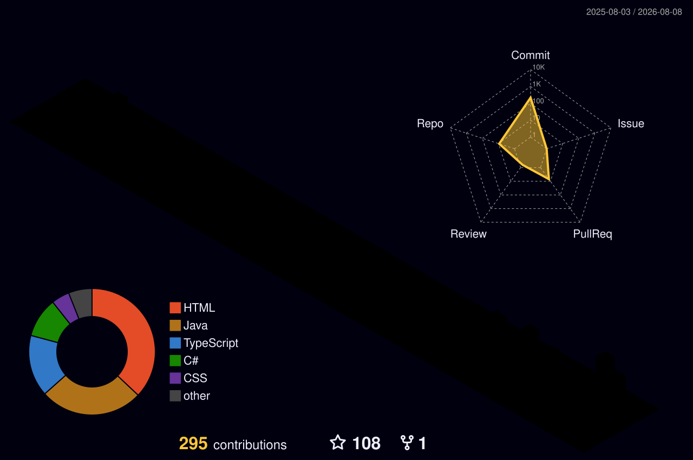

 

---

## The short version

I work at the point where a business requirement becomes a system: I write the analysis —
requirements, business rules, process models, interface contracts — then build it in Java and
Spring Boot, with the tests that prove it behaves.

Most developers can show you code. Most analysts can show you documents.
**[EuroPay Hub](https://github.com/abdessalems/europay-hub)** is the same project as both — a business
requirements document, functional specification, rule catalogue, user stories with acceptance
criteria, BPMN and UML models and API contracts, next to the Spring Boot service that implements
them and the ArchUnit + Testcontainers suite that keeps it honest.

| Analysis | Engineering |
| --- | --- |
| Requirements engineering · functional specifications · business rules | Java 21 · Spring Boot 3 · Spring Security · JPA/Hibernate |
| Use cases · user stories · Given/When/Then acceptance criteria | REST API design · JWT & API-key auth · OpenAPI contracts |
| BPMN process models · UML (use case, class, ER, state, sequence) | PostgreSQL · Flyway migrations · data modelling |
| Test cases · SQL validation · traceability · risk analysis | JUnit 5 · Testcontainers · ArchUnit · Docker · GitHub Actions |

---

## What I actually build in

> Written by hand, because the automated language card counts committed bytes — which rewards
> template CSS and images, not the work.

| | |
| --- | --- |
| **Daily** | Java 21 · Spring Boot 3 · PostgreSQL · Flyway · Docker · JUnit 5 · Testcontainers |
| **Regularly** | TypeScript · Next.js / React · Angular · Vue 3 · .NET / C# · Python / FastAPI |
| **Analysis tooling** | BPMN · PlantUML (use case, class, ER, state, sequence) · OpenAPI · SQL |
| **Delivery** | GitHub Actions · Docker Compose · Git · Maven / Gradle |

---

## Selected work

**EuroPay Hub** — seven bounded contexts behind one API: merchant onboarding, orders, an explicit
payment state machine, idempotent payment creation, HMAC-signed webhooks with a transactional
outbox, an append-only audit log. Clean Architecture + DDD, layering enforced in CI by ArchUnit.
Full functional-analysis document set in [`docs/`](https://github.com/abdessalems/europay-hub/tree/main/docs).

---

## Activity

<!-- Commit/PR/issue counts and streak are honest: they measure what I did, not what language a template was written in -->

 

  

<picture>
  <source media="(prefers-color-scheme: dark)" srcset="https://raw.githubusercontent.com/abdessalems/abdessalems/output/github-snake-dark.svg"/>
  <source media="(prefers-color-scheme: light)" srcset="https://raw.githubusercontent.com/abdessalems/abdessalems/output/github-snake.svg"/>
  
</picture>

  

---

## Background

- **2019–2021** — Functional Analyst & Java Developer, Leejam Sports (Fitness Time), Saudi Arabia
- **2021–2024** — Relocated to Belgium and retrained: IT studies at EPFC Brussels and EFFICOM Lille — web back-end, test-driven development, DevOps — alongside an MBA in IT Management (2025)
- **2024–present** — Self-employed full-stack developer and functional analyst, Brussels

Around **four years** of professional experience across Saudi Arabia and Belgium.
Arabic (C2) · French (B2) · English (B2) · Dutch (A2)

