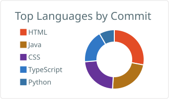
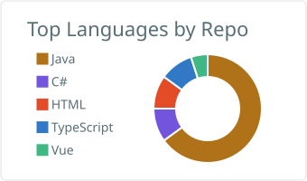

<!-- Hand-authored animated SVG — assets/hero.svg in this repository -->

## The short version

I work at the point where a business requirement becomes a system: I write the analysis —
requirements, business rules, process models, interface contracts — then build it in Java and
Spring Boot, with the tests that prove it behaves.

Most developers can show you code. Most analysts can show you documents.
**[EuroPay Hub](https://github.com/abdessalems/europay-hub)** is the same project as both.

| Analysis | Engineering |
| --- | --- |
| Requirements engineering · functional specifications · business rules | Java 21 · Spring Boot 3 · Spring Security · JPA/Hibernate |
| Use cases · user stories · Given/When/Then acceptance criteria | REST API design · JWT & API-key auth · OpenAPI contracts |
| BPMN process models · UML (use case, class, ER, state, sequence) | PostgreSQL · Flyway migrations · data modelling |
| Test cases · SQL validation · traceability · risk analysis | JUnit 5 · Testcontainers · ArchUnit · Docker · GitHub Actions |

## Stack

**Daily** — Java 21 · Spring Boot 3 · PostgreSQL · Flyway · Docker · JUnit 5 · Testcontainers
**Regularly** — TypeScript · Next.js / React · Angular · Vue 3 · .NET / C# · Python / FastAPI
**Analysis** — BPMN · PlantUML · OpenAPI · SQL

## Selected work

| Project | Stack | What it is |
| --- | --- | --- |
| **[EuroPay Hub](https://github.com/abdessalems/europay-hub)** | `Java 21` `Spring Boot 3` `PostgreSQL` `React` | Merchant payment platform — analysis and implementation in one repository |
| **[Functional Analyst Workspace](https://github.com/abdessalems/Functional-Analyst-Workspace)** | `Next.js 15` `React 19` `TypeScript` | A functional analysis you can click through, end to end · [live](https://www.saadaoui.it.com/fa) |
| **[AI Knowledge Assistant](https://github.com/abdessalems/ai-company-knowledge-assistant-rag)** | `.NET` `EF Core` `Angular` `Ollama` | On-premise RAG over company documents, answers cited to page and section |
| **[SaaS Billing & Identity](https://github.com/abdessalems/saas-billing-identity)** | `Java` `Spring Security` `JWT` `Docker` | Subscription billing with plan-based entitlement enforced through AOP |
| **[FSBE](https://github.com/abdessalems/FastApiProject)** *(collaboration)* | `Python` `FastAPI` `SQLAlchemy` | Activity planning API — two-person project, I wrote 43 of 50 commits |

**EuroPay Hub** — merchant onboarding, orders, an explicit payment state machine, idempotent payment
creation, HMAC-signed webhooks with a transactional outbox, an append-only audit log. Clean
Architecture + DDD, layering enforced in CI by ArchUnit, 37 tests green. The full
functional-analysis document set lives in
[`docs/`](https://github.com/abdessalems/europay-hub/tree/main/docs) — business requirements,
functional specification, business rules, user stories, acceptance criteria, API contracts, test
cases, risk analysis.

**Functional Analyst Workspace** — an analysis you can click through, requirement by requirement, to
the test that closes the loop. The traceability matrix is *derived* from the artefacts' own links,
so it cannot drift. Live at [saadaoui.it.com/fa](https://www.saadaoui.it.com/fa).

## Where the code goes

<picture>
  <source media="(prefers-color-scheme: dark)" srcset="./profile-summary-card-output/github_dark/2-most-commit-language.svg"/>
  
</picture>
<picture>
  <source media="(prefers-color-scheme: dark)" srcset="./profile-summary-card-output/github_dark/1-repos-per-language.svg"/>
  
</picture>

Measured in <b>commits</b>, not committed bytes — so a downloaded template cannot outweigh a year of Java.

  

<picture>
  <source media="(prefers-color-scheme: dark)" srcset="https://raw.githubusercontent.com/abdessalems/abdessalems/output/github-snake-dark.svg"/>
  <source media="(prefers-color-scheme: light)" srcset="https://raw.githubusercontent.com/abdessalems/abdessalems/output/github-snake.svg"/>
  
</picture>

## Background

- **2019–2021** — Functional Analyst & Java Developer, Leejam Sports (Fitness Time), Saudi Arabia
- **2021–2024** — Relocated to Belgium and retrained: IT studies at EPFC Brussels and EFFICOM Lille — web back-end, test-driven development, DevOps — alongside an MBA in IT Management (2025)
- **2024–present** — Self-employed full-stack developer and functional analyst, Brussels

Around **four years** of professional experience across Saudi Arabia and Belgium.
Arabic (C2) · French (B2) · English (B2) · Dutch (A2)
